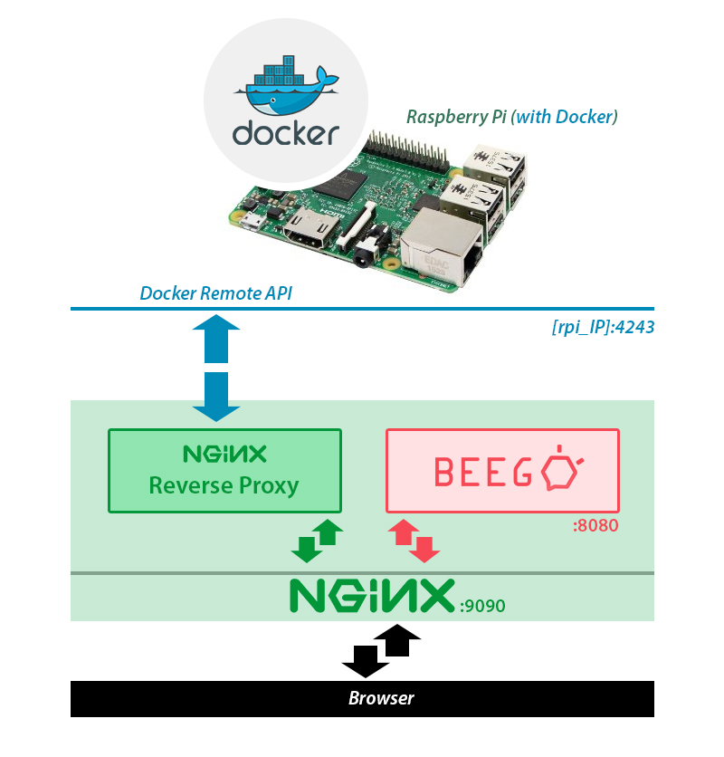

Simple UI for docker
====================
Docker has a REST api called "Remote API" and the following steps will help to expose it in order to be used by a simple UI. The UI is a Beego app and the API is exposed through a reverse proxy.




How to expose the "Docker Remote API"
-------------------------------------
```bash
sudo nano /etc/systemd/system/docker.service.d/remote-api.conf
# add the following lines:
Service]
ExecStart=
ExecStart=/usr/bin/dockerd -H tcp://0.0.0.0:4243 -H unix:///var/run/docker.sock
```


How to setup NginX
------------------
```bash
# installation
sudo apt-get install nginx
# nginx restart (after modifying configuration file)
sudo nginx -s reload
```

First you have to open the nginx configuration file and then locate the part for the http configuration:
```bash
# open the file
sudo nano /etc/nginx/nginx.conf

# and then try to find the http part:
http {
   ...
}
```

Inside http you have to put the following settings:
```bash
server {
  listen 9090;

  location / {
    proxy_pass http://localhost:8080/;
  }

  location /rpi/ {
    proxy_pass http://10.143.0.218:4243/;
  }
}
```

What this actually does:

 * we have a server listening at port 9090
 * common url requests are forwarded to the Beego app (location /)
 * other requests with urls that contain `/rpi/` are forwarded to the Docker Remote API (location /rpi/)


How to run the Beego app
------------------------
This is a Beego app, so you have to go to your "Go"/src directory, clone this git project and launch it:
```bash
# something like this...
cd ~/gowork/src
git clone https://bitbucket.org/mnlab-dev/rpi_docker_ui.git
cd rpi_docker_ui
bee run watchall # this runs at port 8080
```